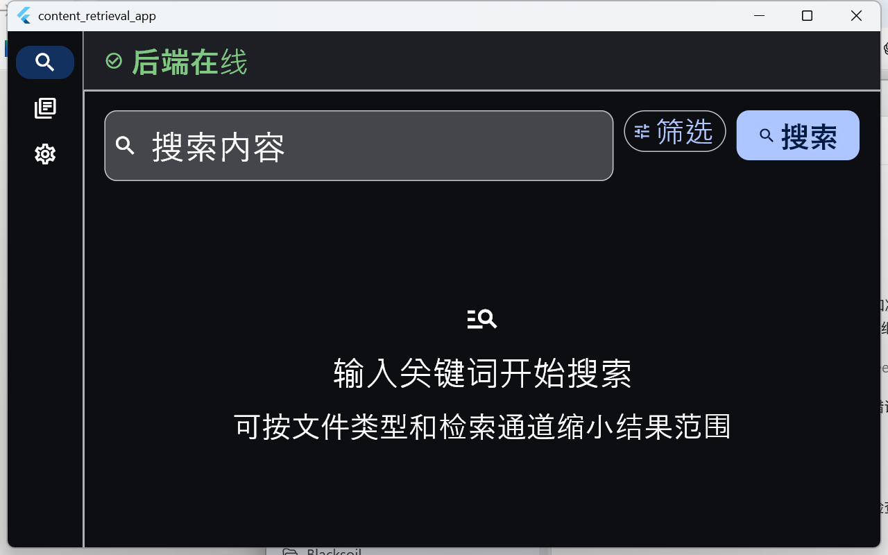
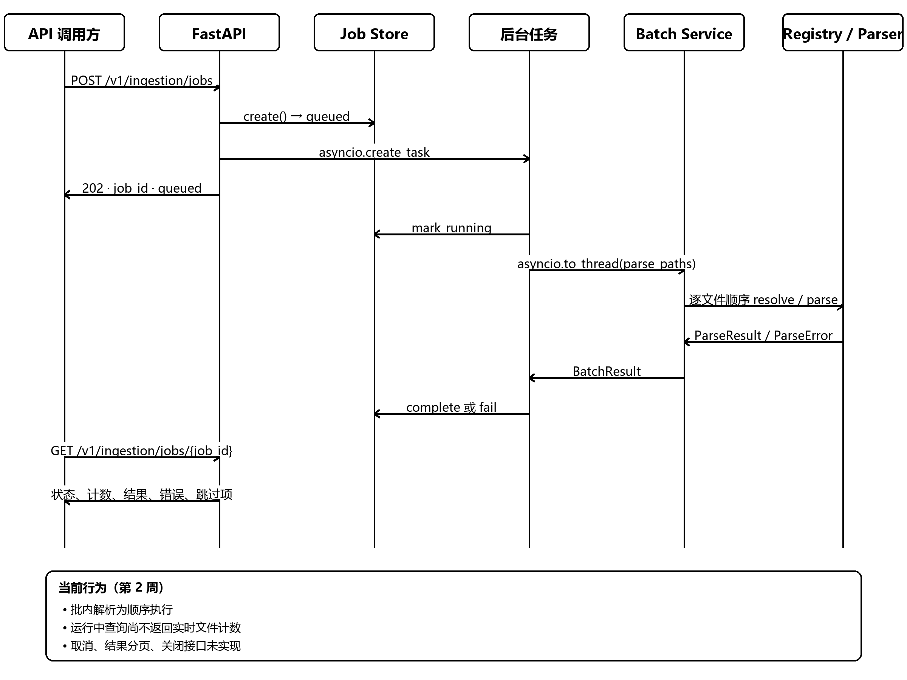

# 离线可访问多模态本地内容检索系统

公开仓库名称：`offline-accessible-multimodal-retrieval`

本项目在本机解析、索引和检索 TXT、PDF、DOCX、JPEG 与 PNG 文件。后端使用 FastAPI、
Sentence Transformers 和 Chroma；非商业研究配置可选装 MobileCLIP。前端使用 Flutter，
提供搜索、索引库管理、设置持久化和无障碍支持。运行时不需要把用户文件或查询发送到远程服务。

## 当前能力与边界

| 能力 | 当前实现 |
|---|---|
| 文本解析 | `.txt`（UTF-8/带 BOM 的 UTF-16、UTF-32）、`.pdf`、`.docx` |
| 图片解析 | `.jpg`、`.jpeg`、`.png` |
| 检索通道 | 公开版提供关键词 BM25、文本语义及加权 RRF；研究配置另提供图文语义 |
| 元数据过滤 | MIME 类型、文本/图片模态、绝对路径前缀、修改时间范围 |
| 本地持久化 | Chroma 数据位于所选数据目录的 `chroma/` 子目录 |
| 客户端 | Flutter Windows、Linux、macOS、Android、Web 工程 |
| 无障碍 | 键盘导航、语义标签、高对比度、200% 字号、减少动态效果 |

当前 API 没有身份认证和授权中间件，启动器因此只把服务绑定到 `127.0.0.1`。不要把端口直接
暴露给其他主机。索引和摄取任务状态保存在进程内存中，重启后不能继续查询旧任务 ID；
Chroma 索引本身会持久化。

> 已知契约差异：Flutter 的“图片”筛选会包含 `image/webp`，但后端解析器目前不支持 WebP。
> WebP 文件不能被当前索引流程写入，项目支持格式应以后端解析器注册表为准。

## 界面与流程





## 桌面发布状态说明

| 平台 | 工程与门禁 | 发布说明 |
|---|---|---|
| Windows x64 | Flutter Release、Temurin jlink、公开/研究双包与归档验证脚本 | v1.0.0 产物必须从冻结提交重新构建并通过校验 |
| Ubuntu 24.04 x64 | 官方 Linux Flutter SDK、Temurin、确定性 tar.gz 与启动检查 | 只能由真实 Linux Release 构建证据判定 PASS |
| macOS | Darwin 主机脚本、归档校验、五格式与 VoiceOver 门禁 | 没有真实 macOS 主机证据时保持 BLOCKED |

仓库中存在某个平台工程不等于该平台已通过生产发布验收；最终状态以第八周统一交付清单为准。

## 快速开始

### 准备条件

- Windows PowerShell；后端要求 64 位 Python `>=3.10,<3.11`。
- 已安装 `uv` 和可运行的 Java；开发 Flutter UI 时还需 Flutter SDK。
- 公开版需要 `models/model-manifest.json` 及其声明的文本模型通过 SHA-256 校验。
- 图文语义研究配置还需单独准备固定版本的 MobileCLIP 源码与受研究许可证约束的权重。
- `tools/tika/tika-server-standard-3.3.1.jar` 与仓库内 SHA-512 文件匹配。

模型准备和固定版本说明见 [第三周嵌入模块说明](docs/week3/README.md)，Tika 准备见
[Tika 本地服务说明](tools/tika/README.md)。

### 第 1 步：同步锁定的后端依赖

```powershell
uv sync --project backend --locked
```

该命令只安装默认公开版依赖，不依赖仓库外的本机目录。需要图文语义研究能力时，按
[第四周运行手册](docs/week4/MVP_RUNBOOK.md)显式安装固定版本的 MobileCLIP 源码，并遵守
权重的非商业研究许可；该依赖和权重均不属于默认公开发行。

### 第 2 步：执行只读预检

```powershell
powershell -ExecutionPolicy Bypass -File tools/start-mvp.ps1 -CheckOnly
```

成功时输出 `MVP preflight passed`。预检会验证 Python 版本、Java、端口、模型清单与模型摘要、
Tika JAR 摘要以及数据目录写入能力，但不会启动长期服务。

仅含文本模型的公开清单会自动关闭图片语义通道；若显式请求该通道，API 会返回受控的能力不可用
错误，而不会静默下载模型或退化成错误结果。

### 第 3 步：启动并检查后端

```powershell
powershell -ExecutionPolicy Bypass -File tools/start-mvp.ps1
```

在另一个终端验证：

```powershell
Invoke-RestMethod http://127.0.0.1:8000/health/live
Invoke-RestMethod http://127.0.0.1:8000/health/ready
```

就绪响应为 `{"status":"ready"}`。启动器会复用健康的本地 Tika；若由启动器创建 Tika，
退出时只停止本次创建的进程。按 `Ctrl+C` 后，后端会先排空索引后台任务再关闭 Chroma。

### 启动 Flutter 前端

保持后端运行，然后执行：

```powershell
Set-Location frontend
flutter pub get
flutter run -d windows
```

默认后端地址是 `http://127.0.0.1:8000`，可在应用“设置”页修改。

## 项目结构

```text
backend/             FastAPI、解析、分块、嵌入、索引、检索和 Chroma 存储
frontend/            Flutter 应用、平台工程、单元/组件/集成测试
models/              本地模型与模型清单（真实大文件通常不进入 Git）
model-tools/         模型下载、准确率与性能评测
conversion-tools/    LiteRT 转换及一致性验证
datasets/            可审计的验证集准备脚本与冻结元数据
tools/               MVP 启动器、Tika 与 Week 5/6 验收和打包工具
docs/                项目级技术文档、周交付记录、设计与实施历史
```

## 技术文档

- 架构深度说明（`docs/ARCHITECTURE.md`）：运行时组装、数据身份、索引与检索流程、并发和取舍。
- HTTP API 参考（`docs/API_REFERENCE.md`）：全部端点、字段、约束、状态码和可复制示例。
- 维护指南（`docs/MAINTENANCE_GUIDE.md`）：环境、测试、备份、扩展、排障、发布和文档同步规则。
- [Flutter 前端说明](frontend/README.md)：客户端分层、配置位置和前端验证命令。
- [产品原则](PRODUCT.md) 与 [设计系统](DESIGN.md)：用户目标、视觉和无障碍基线。

## 常用验证

```powershell
# 后端快速回归（不需要真实模型和 Tika）
& '.\backend\.venv\Scripts\python.exe' -m pytest `
  backend/tests `
  -m 'not requires_models and not requires_tika and not stress'

# Flutter 静态检查和测试
Set-Location frontend
flutter analyze
flutter test
```

完整的 Week 6 集成、压力、性能、离线安全和交付门禁见
[第六周执行与证据入口](docs/week6/README.md)。

## 开源许可证与第三方材料

项目自有代码和文档采用 [Apache License 2.0](LICENSE)。第三方软件、模型、工具和数据集不因项目许可证而被重新授权；来源、固定版本、许可证和发行限制见 [第三方声明](THIRD_PARTY_NOTICES.md) 与 [开源合规审查](docs/OPEN_SOURCE_COMPLIANCE.md)。

参与开发前请阅读[贡献指南](CONTRIBUTING.md)、[社区行为准则](CODE_OF_CONDUCT.md)和[安全策略](SECURITY.md)。版本变化见 [CHANGELOG](CHANGELOG.md)，第八周发布边界与已知限制见[发布说明](docs/week8/RELEASE_NOTES_v1.0.0.md)。
